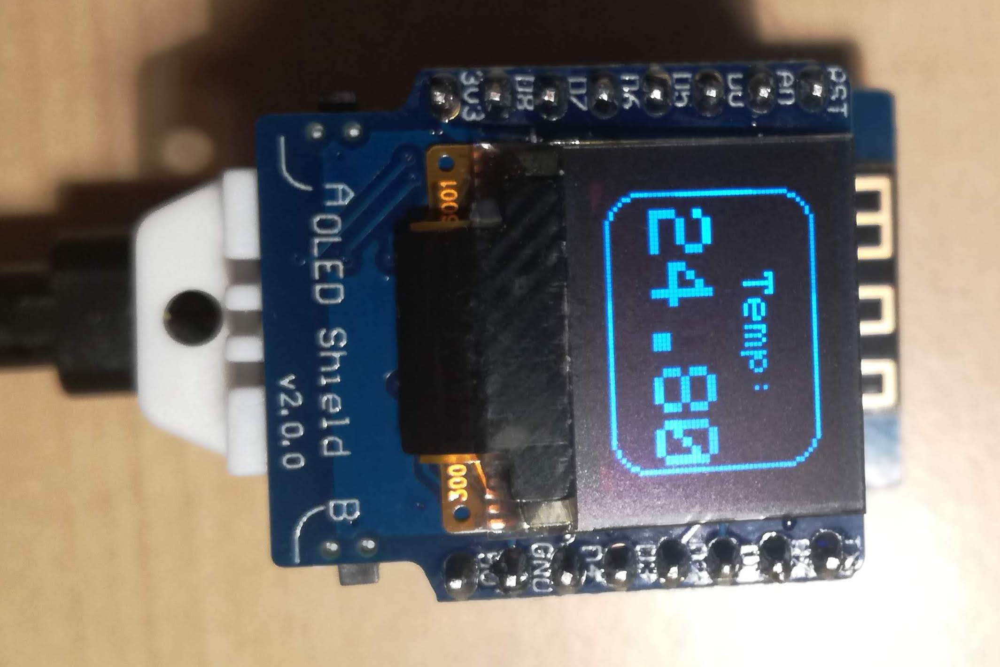

# esp8266_oled_dht22
Simple program to display temperature, humidity, heat temperature, temperature graph and humidity graph

## Hardware
1. Wemos d1 mini
2. Wemos shield DHT22
3. Wemos OLED shield (V2.0.0)

## Software
### Libraries
1. SPI.h
2. Wire.h
3. Adafruit_GFX.h
4. Adafruit_SSD1306.h
5. DHT.h

## Preview

### Temperature

### Humidity

### Heat

